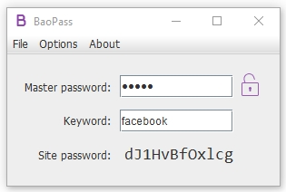

# BaoPass

BaoPass is a deterministic password generator with the novel addition of a keyfile.

**Should I use BaoPass to manage my passwords?**

No. It has not been tested enough and some features are not finished. But please take a look and let me know if you find something I can improve upon.

**How does it work?**

- Something you have (a keyfile) + something you know (a master password) = access to all your passwords
- Your encrypted keyfile contains a randomly generated key. You will never see or type it, so you won't expose it accidentally.
- An individual site password is cryptographically generated from [site name] + [key]. Generated passwords allow syncless operation with multiple devices.

**What makes it secure?**
- Tiny attack surface (no networking)
- [Don't roll your own crypto](http://security.stackexchange.com/questions/18197/why-shouldnt-we-roll-our-own) (BaoPass uses trusted implementations of widely accepted cryptographic algorithms. BaoPass does not combine these algorithms in new ways or use them for unintended use cases.)
- 2-factor-auth (unlike with other deterministic password generators, exposure of your master password will not be a catastrophy)

**Can you ramble on about something vaguely related?**

It turns out that I can. So, I'm basically fixing #4 of [4 fatal flaws in deterministic password managers.](https://tonyarcieri.com/4-fatal-flaws-in-deterministic-password-managers) Good read. Oh, and also, I'm going to implement notes in the future. Then it will be a full fledged password manager with emphasis on security. And it's going to keep state, but not sync it across devices. Yuck.